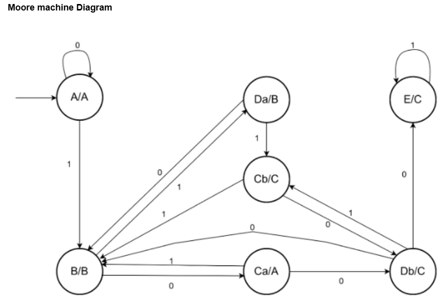

# CS13A - Automata Theory and Formal Languages
## Lab 2 - Mealy and Moore Machines

**Transition Table:**
| State | Input 0 | Input 1 |
|-------|---------|---------|
| A | (A, A) | (B, B) |
| B | (C, A) | (D, B) |
| C | (D, C) | (B, B) |
| D | (B, B) | (C, C) |
| E | (D, C) | (E, C) |

### Mealy Machine Diagram

### Moore Machine Diagram  

